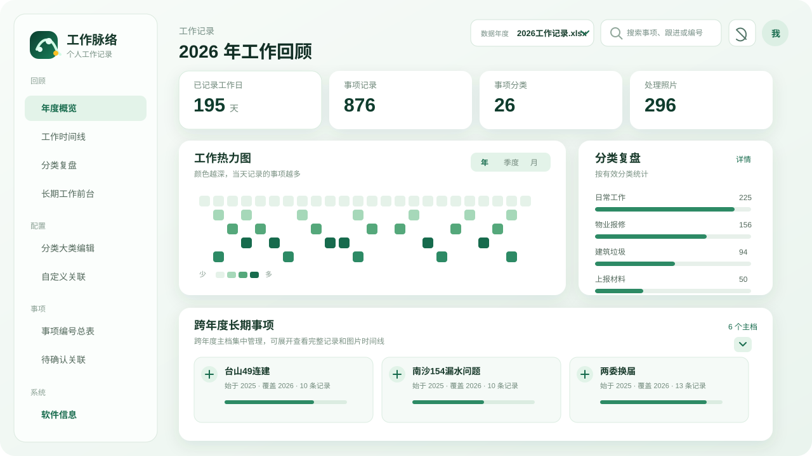

<div align="center">

# 工作脉络

### 把零散的工作记录，整理成可回顾、可追踪、可写成年度报告的工作脉络

个人工作记录可视化与长期事项复盘客户端。支持本地 Excel、个人 WPS 云文档、事项串联、类别分析、长期工作项目和 AI 年度报告素材导出。

[](https://github.com/Oskrrrr/work-review/actions/workflows/ci.yml)
[](https://www.electronjs.org/)
[](https://react.dev/)
[](https://github.com/kdocs-app/kdocs-skill)

<br />

**本地优先 · 隐私友好 · 面向真实工作复盘**

</div>

<p align="center">
  
</p>

## 为什么做这个工具

工作记录通常散落在 Excel 的日期行里：同一件事可能跨越几个月，跟进内容分布在不同日期，年终回顾时很难看出工作的连续性。

工作脉络把这些记录转换成几个更适合复盘的视角：

| 视角 | 能看到什么 |
| --- | --- |
| 年度概览 | 工作热力图、工作日分布、分类趋势和当天全部记录 |
| 工作时间线 | 按日期、类别、关键词检索和筛选每一项工作 |
| 长期工作前台 | 从首次记录到最近跟进的持续周期、节点和进展 |
| 事项编号总表 | 将属于同一工作的多条记录串联起来，并允许逐条移除错误关联 |
| AI 年度报告素材 | 导出“大类-小类”、事项编号、长期项目和完整时间线组成的 Markdown 文字稿 |

## 功能亮点

- 从 Excel 解析日期、分类、跟进内容和 `DISPIMG` 图片引用
- 通过年度热力图快速定位高强度工作日期，并支持隐藏法定节假日和双休日
- 工作卡片显示“大类-小类”，多图记录支持上一张/下一张浏览
- 自动给跨日期、相似内容的记录生成事项关联建议
- 支持自定义关联、事项编号、类别纠正和关联排除词
- 长期工作前台按持续时间、记录次数和事项编号排序与筛选
- 一键导出适合交给 AI 的年度工作报告素材，或复制到剪贴板
- 可生成年度总结海报，保存前支持工作内容打码
- 可手动区分长期事项与阶段性工作，长期事项支持办结和重新打开
- 个人 WPS 模式使用官方 `kdocs-cli`，每个用户登录自己的账号
- 配置和工作记录默认保存在当前客户端；支持手动导出/导入配置
- Windows Electron 客户端，同时保留网页/PWA 运行方式

## 安装使用

### Windows 客户端

从 [Releases](https://github.com/Oskrrrr/work-review/releases) 下载标准命名的 `work-review-*-windows-x64-setup.exe`，安装后即可使用。当前版本为 `work-review-0.8.0-windows-x64-setup.exe`。

### 0.8.0 更新

- 跨年度长期事项主档现在可以直接添加任意年度的一条或多条工作记录。
- 支持将去年只有一条的历史记录加入今年已经建立的长期事项，不需要为了满足自动关联条件而凑成两条记录。
- 主档详情新增“添加历史记录”入口，可按数据年度和关键词选择记录。
- 添加的单条记录会在项目详情中单独标记为“主档记录”，与年度事项编号并列展示。
- 支持将单条记录移出主档，原始记录和事项编号不会被删除。
- 记录链接同时保存来源特征，WPS 更新导致记录 ID 变化时仍可尝试恢复关联。

### 0.7.5 更新

- 修复个人 WPS 更新后，已经确认的关联再次出现在“待确认关联”的问题。
- 为已确认工作增加稳定关联指纹，记录 ID 变化后仍能识别为同一项工作。
- 配置备份升级为完整备份：覆盖所有已导入年度数据集，而非只保存当前数据集。
- 备份新增年度显示名称、数据年度、事项编号、分类大类、自定义关联、排除词、关联历史、跨年度长期主档、个人 WPS 文件绑定、待确认处理记录和隐藏内容偏好。
- 保留旧版配置文件的导入兼容；备份不包含原始工作记录、图片和登录密钥。

### 0.7.4 更新

- 新增事项编号合并：在“事项编号总表”勾选同一件工作被拆成的多个编号，点击“合并选中事项”即可合并为一个事项。
- 合并时保留第一项作为目标，所有工作记录、分类修正、跨年度主档和自定义关联会一并迁移；原始工作记录不会删除。
- 合并后的事项会重新按最早记录日期规范编号，避免出现重复或断号。

### 跨年度长期事项

在“事项编号总表”中将事项标记为“长期事项”，即可在“跨年度事项”列选择已有主档或新建主档。下一年度导入同一项目产生的新事项后，选择相同主档，长期工作前台会显示“始于”年份、覆盖年份以及累计记录数；年度概览仍只统计当前选择的年度，不会把跨年度数据重复计入。

首次使用有两种方式：

1. 在「数据与同步」中登录个人 WPS，搜索并选择工作记录 Excel。
2. 跳过 WPS 登录，直接导入本地 Excel。

Windows 安装包会在构建时从官方来源获取并内置固定版本的 `kdocs-cli`，普通用户不需要再手动安装。开发者从源码打包时，`scripts/fetch-kdocs-cli.cjs` 会自动下载并校验组件。个人 WPS 登录仍由 `kdocs-cli` 的官方登录流程完成。组件来源和版本说明见 [docs/第三方组件.md](docs/第三方组件.md) 以及官方项目：[kdocs-app/kdocs-skill](https://github.com/kdocs-app/kdocs-skill)。

如果所在网络无法下载官方组件，仍然可以跳过 WPS 登录，直接导入本地 Excel 工作簿。

### 从源码运行

要求：Node.js 20+、pnpm 9+。

```powershell
pnpm install
pnpm dev
```

打开终端提示的本地地址，选择「导入工作簿」即可开始使用。

构建 Windows 客户端：

```powershell
pnpm run client:package
```

便携版目录：

```powershell
pnpm run client:dir
```

## 隐私与数据安全

工作脉络的个人客户端默认采用本地优先设计：

- 本地 Excel 解析后的记录、图片和人工配置保存在当前客户端的本地存储中。
- 个人 WPS 登录由安装包内的官方 `kdocs-cli` 处理，凭据保存在当前电脑的系统凭据中。
- 个人 WPS 模式不需要本项目的 WPS App ID、App Key 或 CloudBase 云函数。
- AI 年度报告素材在本地生成，不会自动发送给任何 AI 服务。
- 本项目不内置维护者的 WPS 密钥，也不会把用户密钥写入源码。

不要将真实工作记录、导出的配置、AI 年度报告或 `.env` 文件提交到 GitHub。完整安全说明见 [SECURITY.md](SECURITY.md)。

## 旧版企业 WPS/CloudBase 方案

仓库中保留了早期企业 WPS/CloudBase 兼容代码，位于 `cloudfunctions/` 和 `cloudbase/`，主要用于已有部署的迁移和参考。新用户优先使用 Windows 客户端的个人 WPS 模式或本地 Excel 模式。

旧版部署说明见 [docs/部署到CloudBase.md](docs/部署到CloudBase.md)。

## 开发与贡献

提交前运行：

```powershell
pnpm test -- --run
pnpm build
```

GitHub Actions 会在 push 和 Pull Request 时自动运行测试和网页构建。提交代码前请先阅读 [docs/开源发布清单.md](docs/开源发布清单.md)。

## 项目状态

项目目前处于持续完善阶段。欢迎通过 Issue 反馈 Excel 格式兼容性、长期事项整理方式和客户端使用体验问题。
